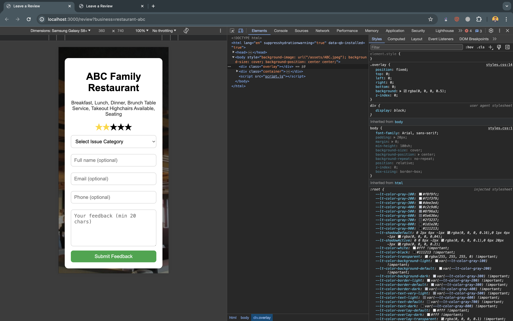

# Smart Review Router

A web application to route happy customers to Google reviews and collect private feedback from unhappy ones — designed for multi-business support with responsive UI and JSON-based data storage.

## Setup Instructions
### 1. Clone the Repositor
```bash
git clone https://github.com/hamxa678/Project.git

cd Project
```

### 2. Install Dependencies
```bash
npm install
```
### 2. Start the Server
```bash
npm run dev
```

expected output:
```bash
> smart-review-router@1.0.0 dev
> nodemon server.js

[nodemon] 3.1.10
[nodemon] to restart at any time, enter `rs`
[nodemon] watching path(s): *.*
[nodemon] watching extensions: js,mjs,cjs,json
[nodemon] starting `node server.js`
Server running at http://localhost:3000
```

## Testing Guide

### Test Business Review URLs

You can test different businesses by using the `?business=` query parameter:

| Business ID        | URL Example                                                                 | Expected Output Screenshot |
|--------------------|------------------------------------------------------------------------------|-----------------------------|
| `restaurant-abc`   | [http://localhost:3000/review?business=restaurant-abc](http://localhost:3000/review?business=restaurant-abc) | [📸 View](./screenshots/restaurant-abc.png) |
| `salon-xyz`        | [http://localhost:3000/review?business=salon-xyz](http://localhost:3000/review?business=salon-xyz)           | [📸 View](./screenshots/salon-xyz.png)      |
| `garage-123`       | [http://localhost:3000/review?business=garage-123](http://localhost:3000/review?business=garage-123)         | [📸 View](./screenshots/garage-123.png)     |
| `invalid-business` | [http://localhost:3000/review?business=invalid-business](http://localhost:3000/review?business=invalid-business) | [📸 View](./screenshots/invalid-business.png) |

### Manual Testing Checklist

- [x] Loads correct business name and background  
- [x] Star ratings 4–5 redirect to Google  
- [x] Star ratings 1–3 show feedback form  
- [x] Form validation works (required fields, phone format)  
- [x] Valid submissions are stored in `data/submissions.json`  
- [x] All interactions are logged in `data/interactions.json`  
- [x] Responsive layout works on mobile  
- [x] Graceful error for invalid business IDs  

## Running Automated Tests (Jest)

### 1. Install dev dependencies (if not yet installed)
```bash
npm install --save-dev jest jest-environment-jsdom
```
### 2. Run Unit Tests
```bash
npm run test
```

Expected output:

```bash
> smart-review-router@1.0.0 test
> jest

 PASS  test/script.test.js
  Functionality Testing
    ✓ fills stars correctly on rating selection (50 ms)
    ✓ form blocks submission for invalid inputs (15 ms)
    ✓ feedback form submission payload structure (14 ms)

Test Suites: 1 passed, 1 total
Tests:       3 passed, 3 total
Snapshots:   0 total
Time:        1.548 s
Ran all test suites.
```

Tests include:

- Star rating interactions  
- Form validation rules  
- Feedback payload structure  

---

## Architecture & Assumptions

### Stack

- **Frontend**: HTML5, CSS3, Vanilla JavaScript (ES6+)
- **Backend**: Node.js + Express
- **Storage**: Local JSON files (no database)
- **Test Framework**: Jest with jsdom

### Key Assumptions

- Each business is identified via a unique `business_id` passed in the query string.
- Business config (name, description, GMB URL, background image) is stored in `data/businesses.json`.
- A rating of **4 or 5** is considered "happy"; **1–3** triggers the internal feedback form.
- Submissions and interactions are persistently logged in flat JSON files.
- Users won't access this app concurrently at high scale (i.e., JSON file writes are acceptable).

---

## Known Limitations / Areas for Improvement

- No user authentication or spam protection on the feedback form  
- No admin dashboard or analytics UI yet  
- JSON file writes may not be suitable for production use (consider DB for scalability)  
- No input sanitization on server (XSS prevention recommended)  
- Form reset doesn't persist user state on refresh  
- No progressive web app (PWA) capabilities yet  


##  Screenshots

Here are some visual examples of the app in action:

#### Landing Page with Business Info and Stars


#### Feedback Form (Shown for Low Ratings)


#### Thank-you Screen


#### Mobile Layout



## Data Structure
for interactions.json:
```bash
 [ 
    {
    "business_id": "garage-123",
    "rating": 5,
    "action": "redirected_to_gmb",
    "timestamp": "2025-07-27T01:18:35.916Z"
  },
  {
    "business_id": "restaurant-abc",
    "rating": 2,
    "action": "shown_feedback_form",
    "timestamp": "2025-07-27T01:19:53.992Z"
  }
]
```
for submissions.json:
```bash
[ 
  {
    "business_id": "restaurant-abc",
    "rating": 1,
    "feedback": "sergerhb sgsekj erkgh eru",
    "category": "Service",
    "customer_name": "Hamza Khan",
    "email": "34523@sdfg.com",
    "phone": "24353475657",
    "timestamp": "2025-07-26T20:46:33.198Z"
  },
  {
    "business_id": "garage-123",
    "rating": 2,
    "feedback": "Ok, but not so good. One should double-check before availing the service.",
    "category": "Service",
    "customer_name": "Hamza Khan",
    "email": "hamxa678@gmail.com",
    "phone": "03369913886",
    "timestamp": "2025-07-27T01:18:26.748Z"
  }
]
```


[📸 View](https://drive.google.com/file/d/1WA82CKzR7jK0CYx4tzuGSfsr_QVYX0nu/view?usp=sharing) 